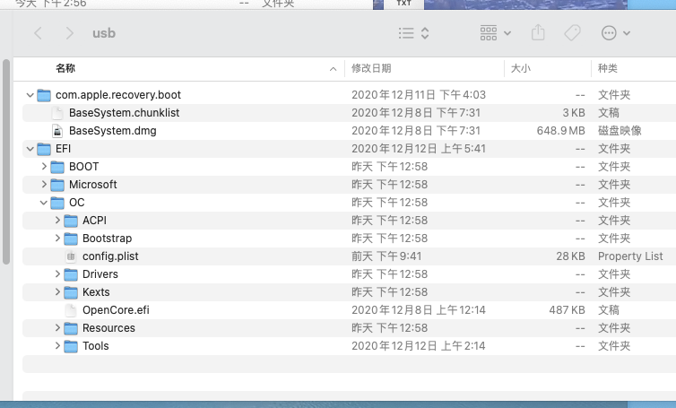

[简体中文](/README.md)｜[English](/README_en.md)

GA-b75md3v-e31230-rx588
=======================


###  一、安装使用说明 ###

#### 硬件准备
- 主板：
- 技嘉B75M-d3v
- cpu：
- e3 1230 v2
- 显卡：
- rx580 8g 2304或者gtx760 gtx770 (均已测试完美)

### 文件夹结构说明 ###
文件夹名称 | 用途 | 备注
:--- | :--- | :---
**EFI** | **启动用的引导** | **主要**
**com.apple.recovery.boot** | **网络恢复镜像存放路径** | ^^
---
- usb驱动内看起来像是这样


- 推荐初始安装原版macOS Catalina 10.15.7后升级 

### 关于常用工具 ###
- [通用 plist 编辑器 ProperTree](https://github.com/corpnewt/ProperTree)
- [SMBIOS生成器](https://github.com/corpnewt/GenSMBIOS)
- [USB驱动定制工具](https://github.com/corpnewt/USBMap)

### CPU变频修复 ###
#### 开始修复:
- Mac下使用ssdtPRGen.sh生成专属的cpu变频文件 
- 使用之前请打开终端先安装```xcode-select --install``` 命令行开发者工具
- 执行如下命令:
- ```curl -o ~/ssdtPRGen.sh https://gitee.com/yaming-network/ssdtPRGen.sh/raw/master/ssdtPRGen.sh```
- ```wc -c ssdtPRGen.sh```
- ```chmod +x ~/ssdtPRGen.sh```
- 运行 ```sudo ./ssdtPRGen.sh```
- 生成的SSDT-CPUM.aml在 ~/Desktop/CPUssdt目录中
- 然后放入acpi目录中启用即可享受原生电源管理和变频
### 白果环境下制作安装u盘 ###
- usb驱动名称 `usbmac`
- [macOS big sur](https://apps.apple.com/cn/app/macos-big-sur/id1526878132?mt=12) `sudo /Applications/Install\ macOS\ Big\ Sur.app/Contents/Resources/createinstallmedia --volume /Volumes/usbmac`
- [macOS Catalina](https://itunes.apple.com/cn/app/macos-catalina/id1466841314?ls=1&mt=12) `sudo /Applications/Install\ macOS\ Catalina.app/Contents/Resources/createinstallmedia --volume /Volumes/usbmac`
- [macOS Mojave](https://itunes.apple.com/cn/app/macos-mojave/id1398502828?ls=1&mt=12) `sudo /Applications/Install\ macOS\ Mojave.app/Contents/Resources/createinstallmedia --volume /Volumes/usbmac`
### 注意 ！ 注意 ! 注意！ ###

- 需要显卡VDA硬解开启的请将SMBIOS 在安装前更改到iMacPro1,1 默认为MacPro6,1
- v2.0版本开始均已经无需升级SMBIOS 机型默认已经升级到iMacPro1,1
- 安装前请自行生成新的三码
- [国内镜像同步地址](https://gitee.com/yaming-network/OpenCore-GA-b75)
- [github代码库地址](https://github.com/wy414012/OpenCore-GA-b75)
- [发布版本说明](/Changelog.md)

### 鸣谢 ###
- [open core](https://github.com/acidanthera/OpenCorePkg) 团队提供的引导以及驱动贡献者
- apple 的OS


 
  
  
  
